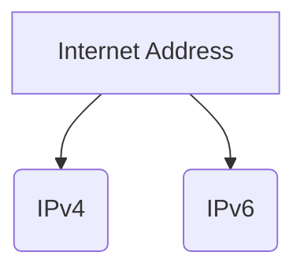
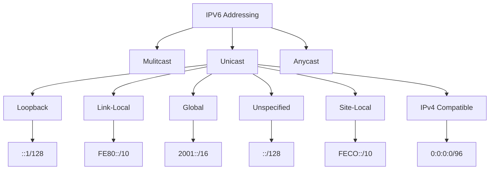

# Unit 02: Internet Address



## Classes in Java.nET package

1. Inet Address : This class represents IP address

2. Inet4 Address : This class repesents IPv4 (version 4) address

3. Inet6 Address : This class repesents IPv6 (version 6) address

4. URL : This class repesents a Uniform Resource Locator, a pointer to a "resource" on the world wide web.

5. URL Connection : This class represent a communication link between the application and a URL

6. URL Class Loader: This class load classes of resources from a search path of URL referring to JAR files and directories.

7. Socket : This class implements client sockets (also called just socket).

8. Socket Address : This class represents a socket address with no protocol attachments.

9. Server Socket : This class implements server sockets.

10. Datagram Packet : This class represents datagram packets.

11. Datagram Socket : This class represents a socket for sending and receiving datagram packets.

12. Network Interface : This class represents a network interface made up of name and list of IP address assigned to this interface.

# Exception in Java.net

1. SocketException : Thrown to indicate that there is an error creating or accessing a socket.

2. ProtocolException : Thrown to indicate that there is an error in the underlying protcol, such as TCP error

3. ConnectException : Signals that an error occured while attempting to connect a socket to a remote address and port.

4. UnkonwonHostException : Thrown to indicate that IP address of host could not be determined.

# IPv6

1. Unicast - It is used for 1 to 1 communication. It sends the packet to a specific node.

2. Multicast - It is used for 1 to many communication. It sends packet to multiple nodes.

3. Anycast - It is used for 1 to 1 of many communication. It sends the packet to multiple nodes but only intended to the closest on its route.



1. Loopback : It is used for TCP/IP configure and NIC testing purpose process

```cmd
ping 127.0.0.1
```
 If reply comes then TCP/IP and NIC working properly.


- ::1/128 corresponding to 127.0.0.0/8 in IPv4
- it is used to send packets back to their source
- IPv4 : 127.0.0.0 to 127.255.255.255

| Name | IP | Meaning |
| :--- | :--- | :--- |
| Global Unicast | 2000::/3 | Publicly routable |
| Unique Local | FC00::/7 | Routable in LAN |
| Link Local | FE80::/10 | Not Routable |
| Multicast | FF00::/8 | Addresses for Groups |
| Anycast | 2000::/3 | Shared address |
